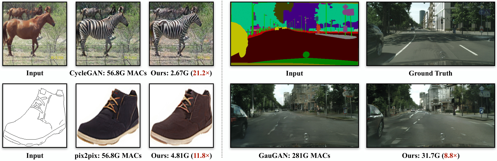
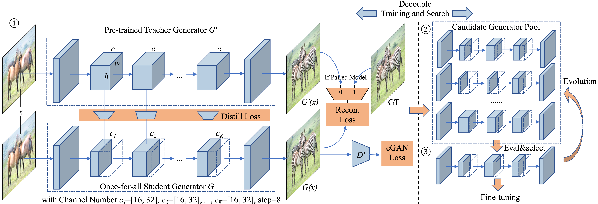

# GAN Compression
### [project](https://hanlab.mit.edu/projects/gancompression/) | [paper](https://arxiv.org/abs/2003.08936) | [demo](https://www.youtube.com/playlist?list=PL80kAHvQbh-r5R8UmXhQK1ndqRvPNw_ex)
**[NEW!]** The [lite pipeline](docs/lite_pipeline.md) (GAN Compression Lite) is updated, which could produce comparable results as the full pipeline with much simpler procedure! The lite version of [map2sat](scripts/pix2pix/map2sat_lite) is released!

**[NEW!]** The lite pipeline (GAN Compression Lite) is released! Check the [tutorial](docs/lite_pipeline.md) for the pipeline.

**[NEW!]** GauGAN training code and tutorial is released! Check the [tutorial](docs/training_tutorial.md) to compress GauGAN.

**[NEW!]** Correct metric naming and update the evaluation protocol. Support MACs budget for searching.

**[NEW!]** The compressed model and test codes of GauGAN are released! Check [here](#gaugan) to use our models.

*We introduce GAN Compression, a general-purpose method for compressing conditional GANs. Our method reduces the computation of widely-used conditional GAN models, including pix2pix, CycleGAN, and GauGAN, by 9-21x while preserving the visual fidelity. Our method is effective for a wide range of generator architectures, learning objectives, and both paired and unpaired settings.*

GAN Compression: Efficient Architectures for Interactive Conditional GANs<br>
[Muyang Li](https://lmxyy.me/), [Ji Lin](http://linji.me/), [Yaoyao Ding](https://yaoyaoding.com/), [Zhijian Liu](http://zhijianliu.com/), [Jun-Yan Zhu](https://www.cs.cmu.edu/~junyanz/), and [Song Han](https://songhan.mit.edu/)<br>
MIT, Adobe Research, SJTU<br>
In CVPR 2020.  

## Demos
<p align="center">
  
</p>

## Overview

*GAN Compression framework: ① Given a pre-trained teacher generator G', we distill a smaller “once-for-all” student generator G that contains all possible channel numbers through weight sharing. We choose different channel numbers for the student generator G at each training step. ② We then extract many sub-generators from the “once-for-all” generator and evaluate their performance. No retraining is needed, which is the advantage of the “once-for-all” generator. ③ Finally, we choose the best sub-generator given the compression ratio target and performance target (FID or mIoU), perform fine-tuning, and obtain the final compressed model.*

## Colab Notebook

PyTorch Colab notebook: [CycleGAN](https://colab.research.google.com/github/mit-han-lab/gan-compression/blob/master/cycle_gan.ipynb) and [pix2pix](https://colab.research.google.com/github/mit-han-lab/gan-compression/blob/master/pix2pix.ipynb).

## Prerequisites

* Linux
* Python 3
* CPU or NVIDIA GPU + CUDA CuDNN

## Getting Started

### Installation

- Clone this repo:

  ```shell
  git clone git@github.com:mit-han-lab/gan-compression.git
  cd gan-compression
  ```

- Install [PyTorch](https://pytorch.org) 1.4 and other dependencies (e.g., torchvision).

  - For pip users, please type the command `pip install -r requirements.txt`.
  - For Conda users, we provide an installation script `scripts/conda_deps.sh`. Alternatively, you can create a new Conda environment using `conda env create -f environment.yml`.

### CycleGAN

#### Setup

* Download the CycleGAN dataset (e.g., horse2zebra).

  ```shell
  bash datasets/download_cyclegan_dataset.sh horse2zebra
  ```

* Get the statistical information for the ground-truth images for your dataset to compute FID. We provide pre-prepared real statistic information for several datasets. For example,

  ```shell
  bash datasets/download_real_stat.sh horse2zebra A
  bash datasets/download_real_stat.sh horse2zebra B
  ```

#### Apply a Pre-trained Model

* Download the pre-trained models.

  ```shell
  python scripts/download_model.py --model cyclegan --task horse2zebra --stage full
  python scripts/download_model.py --model cyclegan --task horse2zebra --stage compressed
  ```

* Test the original full model.

  ```shell
  bash scripts/cycle_gan/horse2zebra/test_full.sh
  ```

* Test the compressed model.

  ```shell
  bash scripts/cycle_gan/horse2zebra/test_compressed.sh
  ```
* Measure the latency of the two models.

  ```shell
  bash scripts/cycle_gan/horse2zebra/latency_full.sh
  bash scripts/cycle_gan/horse2zebra/latency_compressed.sh
  ```

### Pix2pix

#### Setup

* Download the pix2pix dataset (e.g., edges2shoes).

  ```shell
  bash datasets/download_pix2pix_dataset.sh edges2shoes-r
  ```

* Get the statistical information for the ground-truth images for your dataset to compute FID. We provide pre-prepared real statistics for several datasets. For example,

  ```shell
  bash datasets/download_real_stat.sh edges2shoes-r B
  ```

#### Apply a Pre-trained Model

* Download the pre-trained models.

  ```shell
  python scripts/download_model.py --model pix2pix --task edges2shoes-r --stage full
  python scripts/download_model.py --model pix2pix --task edges2shoes-r --stage compressed
  ```

* Test the original full model.

  ```shell
  bash scripts/pix2pix/edges2shoes-r/test_full.sh
  ```

* Test the compressed model.

  ```shell
  bash scripts/pix2pix/edges2shoes-r/test_compressed.sh
  ```

* Measure the latency of the two models.

  ```shell
  bash scripts/pix2pix/edges2shoes-r/latency_full.sh
  bash scripts/pix2pix/edges2shoes-r/latency_compressed.sh
  ```


### <span id="gaugan">GauGAN</span>

#### Setup

* Prepare the cityscapes dataset. Check [here](#cityscapes) for preparing the cityscapes dataset.

* Get the statistical information for the ground-truth images for your dataset to compute FID. We provide pre-prepared real statistics for several datasets. For example,

  ```shell
  bash datasets/download_real_stat.sh cityscapes A
  ```

#### Apply a Pre-trained Model

* Download the pre-trained models.

  ```shell
  python scripts/download_model.py --model gaugan --task cityscapes --stage full
  python scripts/download_model.py --model gaugan --task cityscapes --stage compressed
  ```

* Test the original full model.

  ```shell
  bash scripts/gaugan/cityscapes/test_full.sh
  ```

* Test the compressed model.

  ```shell
  bash scripts/gaugan/cityscapes/test_compressed.sh
  ```
* Measure the latency of the two models.

  ```shell
  bash scripts/gaugan/cityscapes/latency_full.sh
  bash scripts/gaugan/cityscapes/latency_compressed.sh
  ```

### <span id="cityscapes">Cityscapes Dataset</span>

For the Cityscapes dataset, we cannot provide it due to license issue. Please download the dataset from https://cityscapes-dataset.com and use the script [prepare_cityscapes_dataset.py](datasets/prepare_cityscapes_dataset.py) to preprocess it. You need to download `gtFine_trainvaltest.zip` and `leftImg8bit_trainvaltest.zip` and unzip them in the same folder. For example, you may put `gtFine` and `leftImg8bit` in `database/cityscapes-origin`. You need to prepare the dataset with the following commands:

```shell
python datasets/get_trainIds.py database/cityscapes-origin/gtFine/
python datasets/prepare_cityscapes_dataset.py \
--gtFine_dir database/cityscapes-origin/gtFine \
--leftImg8bit_dir database/cityscapes-origin/leftImg8bit \
--output_dir database/cityscapes \
--table_path datasets/table.txt
```

You will get a preprocessed dataset in `database/cityscapes` and a mapping table (used to compute mIoU) in `dataset/table.txt`.

To support mIoU computation, you need to download a pre-trained DRN model `drn-d-105_ms_cityscapes.pth` from http://go.yf.io/drn-cityscapes-models. By default, we put the drn model in the root directory of our repo. Then you can test our compressed models on cityscapes after you have downloaded our compressed models.

### Performance of Released Models

We retrained the models with our released codebase, so there may be some slight differences between our released models and the results in the paper.

<table style="undefined;table-layout: fixed; width: 868px">
<colgroup>
<col style="width: 130px">
<col style="width: 130px">
<col style="width: 130px">
<col style="width: 130px">
<col style="width: 130px">
<col style="width: 109px">
<col style="width: 109px">
</colgroup>
<thead>
  <tr>
    <th rowspan="2">Model</th>
    <th rowspan="2">Dataset</th>
    <th rowspan="2">Method</th>
    <th rowspan="2">#Parameters</th>
    <th rowspan="2">MACs</th>
    <th colspan="2">Metric</th>
  </tr>
  <tr>
    <td>FID</td>
    <td>mIoU</td>
  </tr>
</thead>
<tbody>
  <tr>
    <td rowspan="3">CycleGAN</td>
    <td rowspan="3">horse→zebra</td>
    <td>Original</td>
    <td>11.4M</td>
    <td>56.8G</td>
    <td>65.75</td>
    <td>--</td>
  </tr>
  <tr>
    <td>Full Pipeline</td>
    <td>0.357</td>
    <td>2.55G</td>
    <td>65.12</td>
    <td>--</td>
  </tr>
  <tr>
    <td>Lite Pipeline</td>
    <td>0.355M</td>
    <td>2.64G</td>
    <td>65.19</td>
    <td>--</td>
  </tr>
  <tr>
    <td rowspan="9">Pix2pix</td>
    <td rowspan="3">edges→shoes</td>
    <td>Original</td>
    <td>11.4M</td>
    <td>56.8G</td>
    <td>24.12</td>
    <td>--</td>
  </tr>
  <tr>
    <td>Full Pipeline</td>
    <td>0.822M</td>
    <td>4.99G</td>
    <td>26.70</td>
    <td>--</td>
  </tr>
  <tr>
    <td>Lite Pipeline</td>
    <td>0.756M</td>
    <td>4.61G</td>
    <td>25.26</td>
    <td>--</td>
  </tr>
  <tr>
    <td rowspan="3">Cityscapes</td>
    <td>Original</td>
    <td>11.4M</td>
    <td>56.8G</td>
    <td>61.50</td>
    <td>42.06</td>
  </tr>
  <tr>
    <td>Full Pipeline</td>
    <td>0.781M</td>
    <td>5.59G</td>
    <td>73.45</td>
    <td>38.63</td>
  </tr>
  <tr>
    <td>Lite Pipeline</td>
    <td>NA</td>
    <td>NA</td>
    <td>NA</td>
    <td>NA</td>
  </tr>
  <tr>
    <td rowspan="3">map→arial photo<br></td>
    <td>Original</td>
    <td>11.4M</td>
    <td>56.8G</td>
    <td>47.91</td>
    <td>--</td>
  </tr>
  <tr>
    <td>Full Pipeline</td>
    <td>0.784M</td>
    <td>4.84G</td>
    <td>49.00</td>
    <td>--</td>
  </tr>
  <tr>
    <td>Lite Pipeline</td>
    <td>0.708M</td>
    <td>4.53G</td>
    <td>48.38</td>
    <td>--</td>
  </tr>
  <tr>
    <td rowspan="3">GauGAN</td>
    <td rowspan="3">Cityscapes</td>
    <td>Original</td>
    <td>93.0M</td>
    <td>281G</td>
    <td>57.60</td>
    <td>61.04</td>
  </tr>
  <tr>
    <td>Full Pipeline</td>
    <td>21.0M</td>
    <td>31.2G</td>
    <td>56.43</td>
    <td>60.29</td>
  </tr>
  <tr>
    <td>Lite Pipeline</td>
    <td>NA</td>
    <td>NA</td>
    <td>NA</td>
    <td>NA</td>
  </tr>
</tbody>
</table>


## Training

Please refer to the [lite_pipeline.md](docs/lite_pipeline.md) and [full_pipeline.md](docs/full_pipeline.md) on how to train models on our datasets and your own.

### FID Computation

To compute the FID score, you need to get some statistical information from the groud-truth images of your dataset. We provide a script [get_real_stat.py](./get_real_stat.py) to extract statistical information. For example, for the edges2shoes dataset, you could run the following command:

  ```shell
python get_real_stat.py \
--dataroot database/edges2shoes-r \
--output_path real_stat/edges2shoes-r_B.npz \
--direction AtoB
  ```

For paired image-to-image translation (pix2pix and GauGAN), we calculate the FID between generated test images to real test images. For unpaired image-to-image translation (CycleGAN), we calculate the FID between generated test images to real training+test images. This allows us to use more images for a stable FID evaluation, as done in previous unconditional GANs research. The difference of the two protocols is small. The FID of our compressed CycleGAN model increases by 4 when using real test images instead of real training+test images. 

## [Code Structure](docs/overview.md)

To help users better understand and use our code, we briefly overview the functionality and implementation of each package and each module.

## Citation

If you use this code for your research, please cite our [paper](https://arxiv.org/pdf/2003.08936).
```
@inproceedings{li2020gan,
  title={GAN Compression: Efficient Architectures for Interactive Conditional GANs},
  author={Li, Muyang and Lin, Ji and Ding, Yaoyao and Liu, Zhijian and Zhu, Jun-Yan and Han, Song},
  booktitle={Proceedings of the IEEE/CVF Conference on Computer Vision and Pattern Recognition},
  year={2020}
}
```


## Acknowledgements

Our code is developed based on [pytorch-CycleGAN-and-pix2pix](https://github.com/junyanz/pytorch-CycleGAN-and-pix2pix) and [SPADE](https://github.com/NVlabs/SPADE).

We also thank [pytorch-fid](https://github.com/mseitzer/pytorch-fid) for FID computation and [drn](https://github.com/fyu/drn) for mIoU computation.
