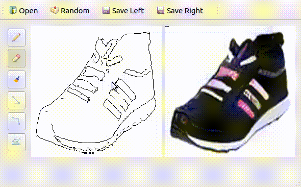

# GAN Compression Interactive Demo on Jetson Nano

<p align="center">
  
</p>

## Overview

We show how to deploy our compressed Pix2pix model on **NVIDIA Jetson Nano**. Our model is compiled with **TVM Auto Scheduler** [1,2] for acceleration. The final model achieves about **8** FPS on Jetson Nano GPU.

[1] Tianqi Chen *et al.*, *TVM: An automated end-to-end optimizing compiler for deep learning*, in OSDI 2018
[2] Lianmin Zheng *et al.*, *Ansor: Generating High-Performance Tensor Programs for Deep Learning.*, in OSDI 2020

## Getting Started

1. Get an [NVIDIA Jeston Nano](https://developer.nvidia.com/embedded/jetson-nano-developer-kit) board (it is only $99!).
2. Get a micro SD card and burn the **Nano system image** into it following [here](https://developer.nvidia.com/embedded/learn/get-started-jetson-nano-devkit). Insert the card and boot the Nano. **Note**: you may want to get a power adaptor for a stable power supply.


3. Follow [here](https://devtalk.nvidia.com/default/topic/1049071/jetson-nano/pytorch-for-jetson-nano/) to install **PyTorch** and **torchvision**.

4. Install [TVM](https://github.com/apache/tvm) 0.8.

   ```shell
   # upgrade cmake
   cd ~
   sudo apt install openssl libssl-dev
   sudo apt remove cmake
   wget https://github.com/Kitware/CMake/releases/download/v3.20.2/cmake-3.20.2.tar.gz
   tar xvf cmake-3.20.2.tar.gz
   cd cmake-3.20.2
   ./bootstrap --prefix=/usr
   make
   sudo make install
   
   cd ~
   sudo apt install llvm # install llvm which is required by tvm
   git clone --recursive https://github.com/apache/tvm tvm
   cd tvm
   mkdir build
   cp cmake/config.cmake build/
   cd build
   vim config.cmake
   # edit config.cmake to change
   # USE_CUDA OFF -> USE_CUDA ON
   # USE_LLVM OFF -> USE_LLVM ON
   # USE_THRUST OFF -> USE_THRUST ON
   # USE_GRAPH_EXECUTOR_CUDA_GRAPH OFF -> USE_GRAPH_EXECUTOR_CUDA_GRAPH ON
   
   cmake ..
   make -j4
   cd ..
   cd python; python3 setup.py install --user; cd ..
   ```

5. Install PyQt5 (Jetson Nano may have pre-installed it).

6. You now can try our demo with

   ```shell
   python3 paint.py
   ```

## Acknowledgement

This demo code is developed based on [Piecasso](https://github.com/learnpyqt/15-minute-apps/tree/master/paint).
